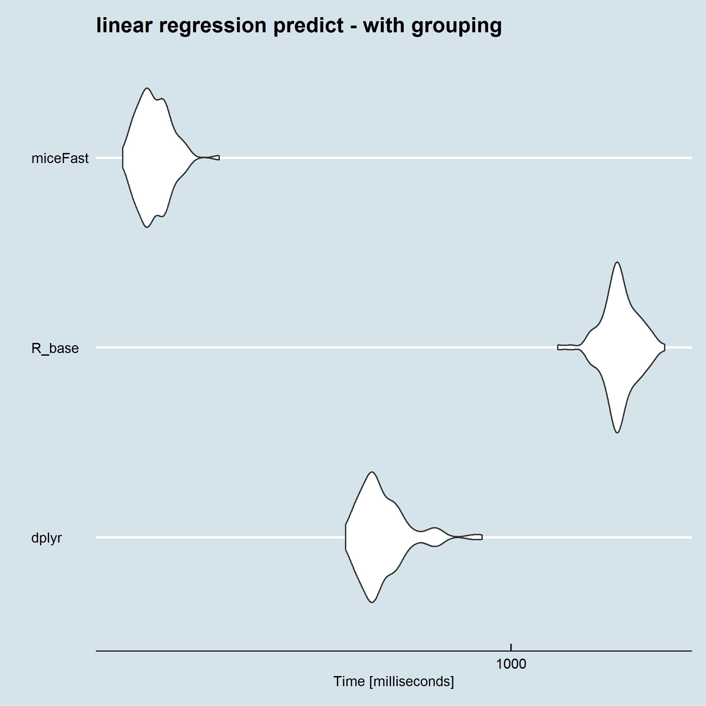

```{r setup, include=FALSE}
knitr::opts_chunk$set(echo = FALSE)
```


Loading packages and set.seed:

```{r,echo=TRUE}
library(pacman)

p_load(Rcpp,
       mice,
       tidyverse,
       broom)

set.seed(1234)
```

## Motivations

Missing data is a common problem. The easiest solution is to delete obserations for which dependent variable is missing. But this will sometimes deteriorate quality of a project. Another solution will be to use methods such multiple imputations to fill missing data. Non missing independent variables gives opportunity to approximate a missing observations for dependent variable. R or Python language are comfortable for data manipulation but pararelly brings slower computations. Langages such C++ gives a oppurtunity to boost our applications or projects.

The presented miceFast module was built under Rcpp packages and the C++ library Armadillo.
The Rcpp package offers functionality of exporting full C++ capabilities to the R envioroment.
More precisly offered modules are miceFast and corrData. The first module offers capabilities of most important raw functions at the mice R package. The main upgrade is possibility of including grouping variable and C++ capabilities.
The second module was made for puropse of presenting miceFast usage and performance. It gives functionality of genereting correleted data with discrete,binomial or continous dependent variable and continious independent varables. 

In the project was used knowledge from mice and MASS R packages.

## Example

###Genereting Data

Loading corrData module:

```{r,echo=TRUE,eval=TRUE}
Rcpp::sourceCpp("C:/Users/user/Desktop/Imputations/Imput/corrData.cpp")
```

Availible constructors:

**new(corrData,nr_cat,n_obs,means,cor_matrix)**

**new(corrData,n_obs,means,cor_matrix)**

where:

- nr_cat : number of categories for discrete dependent variable
- n_obs : number of observations
- means: center independent variables
- cor_mat : positive defined correlation matrix

relevant class methods:

- fill("type") : genereting data

type - ("contin","binom","discrete")


Generting correleted data for all three possible data types of dependent variable

```{r,echo=TRUE}

power = 5 # power of 10 - number of observations - should be adjusted to a computer capabilities

grs = 100 # grouping variable - number of groups

## generete example - data

##positive-defined correlation matrix

cors = matrix(c(1,0.6,0.7,0.4,0.4,0.5,0.35,
                NA,1,0.2,0.05,0.1,0.12,0.15,
                NA,NA,1,0.15,0.15,0.1,0.08,
                NA,NA,NA,1,0.12,0.15,0.1,
                NA,NA,NA,NA,1,0.15,0.2,
                NA,NA,NA,NA,NA,1,0.15,
                NA,NA,NA,NA,NA,NA,1),7,7,byrow = T)

cors[lower.tri(cors)] = t(cors)[lower.tri(cors)]

# automatic corr matrix - close to diagonal

#cors = stats::rWishart(100,10,diag(7)) 

#cors = apply(cors,1:2,mean)/10

#cors

##

model = new(corrData,10,10^power,rep(0,7),cors)

data_bin = model$fill("binom")
data_disc = model$fill("discrete")
data_con = model$fill("contin")

colnames(data_bin) = c("y","x1","x2","x3","x4","x5","group")
colnames(data_disc) = c("y","x1","x2","x3","x4","x5","group")
colnames(data_con) = c("y","x1","x2","x3","x4","x5","group")
```

Sampling 10% of observations - artificial missing values:

```{r,echo=TRUE,echo=TRUE}
## NA index
index_NA = 1:nrow(data_con) %in% sample(1:nrow(data_con),10^(power-1))
```

A grouping variable:

```{r,echo=TRUE}
#Grouping variable

data_disc[,7] = floor(pnorm(data_disc[,7])*grs)

data_disc = data_disc[order(data_disc[,7]),] # sort by group

data_disc = cbind(data_disc,index_NA)

gr_disc = data_disc[,7]

index_NA = as.logical(data_disc[,8])# index_NA after sorting

#continous model

data_con[,7] = floor(pnorm(data_con[,7])*grs)

data_con = cbind(data_con,index_NA)

data_con = data_con[order(data_con[,7]),] # sort by group

gr_con = data_con[,7]

index_NA = as.logical(data_disc[,8])# index_NA after sorting
```

Presenting Data - Continous & Discrete:

```{r,echo=TRUE}
round(head(data_disc),3)
round(head(data_con),3)

round(cor(data_disc),3)
round(cor(data_con),3)
```

###Imputations

Loading miceFast module:

```{r,echo=TRUE}
sourceCpp("C:/Users/user/Desktop/Imputations/Imput/impute.cpp")
```

Building miceFast objects - a simple model or with a grouping variable:

availible constructors:

**new(miceFast,y,x,index_NA)**

**new(miceFast,y,x,index_NA,grouping,sorted)**

where:

- y : depenedent variable
- x : independent variable
- index_NA : vector of bool (or 0/1) where TRUE equal missing!!!
- grouping : vector of integers for grouping variable - you could build it form several discrete varables
- sorted : boolen (TRUE/FALSE) specifying if data is sorted by a grouping variable

relevant class methods:

- impute("model") - impute data 
- imputeby("model") - impute data divide imputations by a grouping variable
- get_models() - posibble quantitative models for a certain type dependent variable
- sortby_g() - sort data by a grouping variable

model - ("lda","lm_pred","lm_bayes","lm_noise")

Simple model:

A continous data:

```{r,echo=TRUE}
model = new(miceFast,data_con[,1],cbind(1,data_con[,c(2:7)]),index_NA)

#get availible predction models
model$get_models()

#implementing lm_pred
pred =  model$impute("lm_pred")

sum((pred-data_con[index_NA,1])^2)

head(cbind(pred,data_con[index_NA,1]))

```

A discrete data:

```{r,echo=TRUE}

model = new(miceFast,data_disc[,1],data_disc[,c(2:7)],index_NA)

#get availible predction models
model$get_models()

#implementing lda
pred =  model$impute("lda")

table(pred,data_disc[index_NA,1])
```

Using a grouping variable:

A continous data:

```{r,echo=TRUE}
model = new(miceFast,data_con[,1],cbind(1,data_con[,c(2:6)]),index_NA,gr_con,TRUE)

#get availible predction models
model$get_models()

#implementing lm_pred
pred =  model$imputeby("lm_pred")

sum((pred-data_con[index_NA,1])^2)

head(cbind(pred,data_con[index_NA,1]))

```

A discrete data:

```{r,echo=TRUE}

model = new(miceFast,data_disc[,1],data_disc[,c(2:6)],index_NA,gr_disc,TRUE)

#get availible predction models
model$get_models()

#implementing lda
pred =  model$imputeby("lda")

table(pred,data_disc[index_NA,1])
```

##Performance

Enviroment: MRO Intel MKL - i7 6700HQ and 24GB DDR4

If you are interesting about procedure of testing performance check performance_validity.R file.

Mice fast was compared with the mice package. For grouping option there was used a basic R looping and a very fast dplyr.

Summing up, miceFast offer a relevant boost of calculations for LDA and all models with grouping option'. 
The results across different approach are quite the same for all three linear model without grouping option.

'It was tested for up to 100 independent variables and  1 million observations.

Plots for 1 milion observations, 7 independent variables and 100 levels for a grouping variable:



